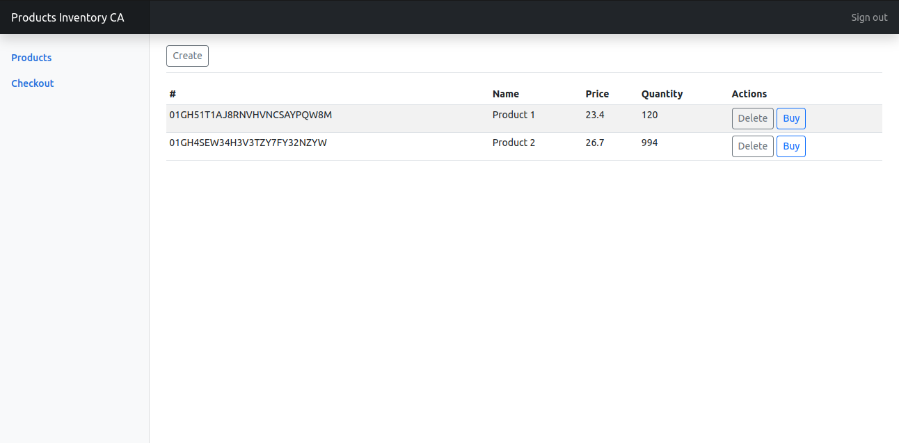

# Payment APP with FastAPI as Microservices

Simple payment app built with FastAPI following the microservices architecture. A payment app normally has a lot of async things happenning on the background, so this app is a simulation of it.

## Technologies

- React (front-end)
- FastAPI (REST API/back-end)
- RedisJSON & RedisStreams (NoSQL database/message queue)

## Architecture

## Screenshots

> Inventory front-end

> Inventory front-end

## Running locally

1. Initialize redis with docker-compose: `docker compose up -d`

2. Change `.env.example` to `.env` in all projects

3. Run back-end
    - Inventory
        1. Install dependencies: `pip install -r requirements.txt`
        2. Run server: `uvicorn --reload --port 5001`
        3. Run consumer: `python consumer.py`

    - Payment
        1. Install dependencies: `pip install -r requirements.txt`
        2. Run server: `uvicorn --reload --port 5002`
        3. Run consumer: `python consumer.py`

4. Run front-end
    1. Install dependencies: `yarn` || `npm install`
    2. Run server: `yarn dev` || `npm run dev`
